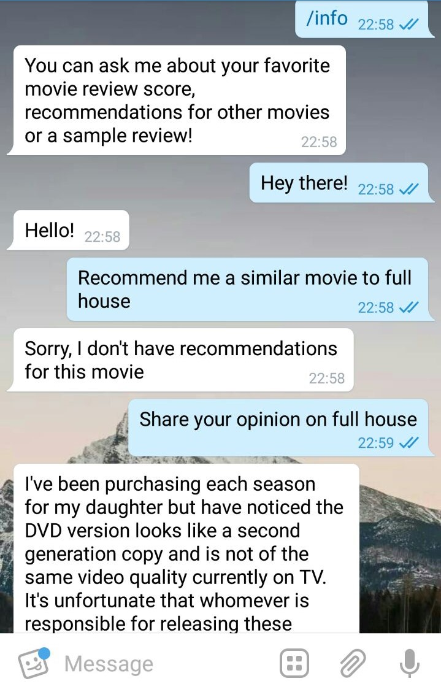
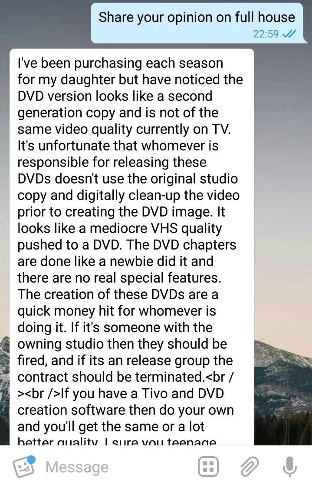
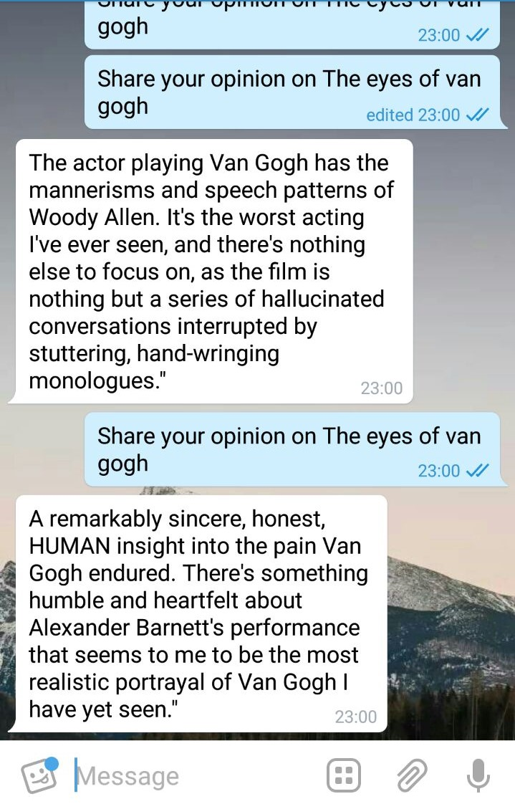
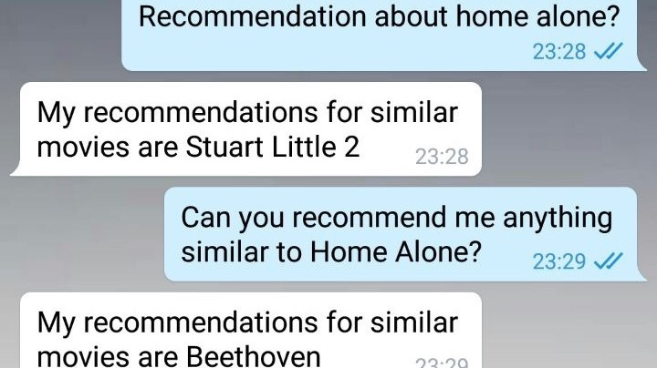
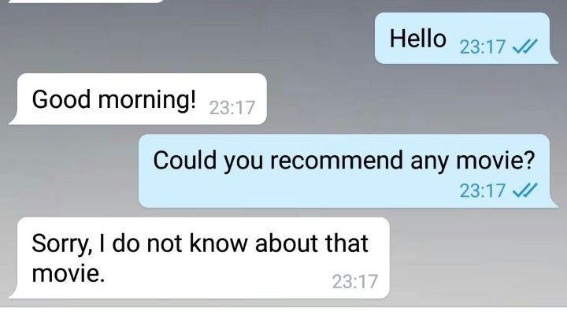
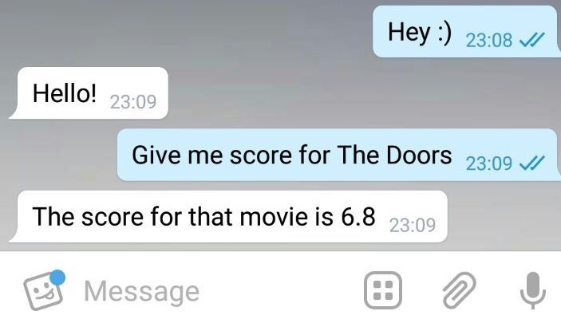

# CCMLWI Chatbot assignment

We developed a movie chatbot for Telegram. It can give you a movie score, review for a movie or recommend a movie similar to the one you mentioned.

We used [Python Telegram bot API](https://github.com/python-telegram-bot/python-telegram-bot), code is written in Python 3.5.

## Chat bot abilities
Our chatbot can handle greetings and goodbyes and can give an introduction of its abilities. The bot lists its abilities with /info command.
It can manage three types of domain specific questions: give movie score, give a random review or recommend a similar movie.


# How does it work?
The chatbot uses [Amazon movie reviews dataset](https://snap.stanford.edu/data/web-Movies.html) to get movies reviews and
[MovieDb API](https://www.themoviedb.org) to get recommendations and movie ratings.

Amazon movie reviews dataset contains product id, reviewer id, reviewer profile name, review helpfulness and score metrics, review summary and review text.
To map the movie name with product id we wrote a crawler for [amazon website](https://www.amazon.com/product-reviews/).

# How to run the bot?

Get pre-trained word2vec embeddings:
```
mkdir MovieBot/embeddings
cd MovieBot/embeddings
wget -c "https://s3.amazonaws.com/dl4j-distribution/GoogleNews-vectors-negative300.bin.gz"
```

Create config.py in the MovieBot folder and add the following information there:
```
telebot_config = 'Your Telegram bot token'
tmdb_config = 'Your tmdb token'
```

Start the bot:
```
python MovieBot.py
```

## Intent detection

Before we do text preprocessing, we remove stop words, punctuation marks and lowercase the words.

We predefined search queries for each of the intents (recommendation, review, score, greetings, goodbyes) and for each of user question we measure the **semantic distance between word2vec vectors - one from an intent keyword and the other from input message**.

We enlarged the keyword vocabulary using **word2vec most similar words** and included some **misspellings** because they often occur in chats:

We tried both keyword and keyphrase matching and found keyphrases to be superior. Examples of both:
```
their_greetings = ['hi', 'hello', 'good morning']
their_goodbyes = ['goodbye', 'bye', 'good-bye', 'see you later', 'cya']
their_score = ['score', 'rating', 'grade', 'average', 'socre', 'ratings', 'averge', 'avearge']
their_recommendation = ['recommend', 'recommendation', 'suggest', 'suggestion', 'propose', 'advise', 'reccomend']
their_review = ['review', 'opinion', 'impression', 'view', 'think', 'opionion', 'veiws']
```
```
recommendation = ['Could you recommend me a movie similar to movie?',
                  'Do you have any suggestions for me?', 'Do you have any recommendations?',
                  'Can you advise me a movie?', 'I need your advice', 'Do you have any recommendations for this movie?',
                  'Do you know any movie similar to this?', 'Do you know something similar to this movie?', 'What would you recommend?',
                  'What could you recommend?', 'Which film could you recommend me?']
score = ['What is the movie rating?', 'What is the movie score?', 'How was the movie scored?']
review = ['What is your opinion on this movie?', 'What is your impression?', 'What do you think about the movie?',
          'What is your point of view on this movie?', 'Can you give me a movie review?', 'Could you give me the review?',
          'Could you share the review for this film?']
```

The better way to do intent detection would be training ML models on a big dataset but we didn't have access to one (or resources to train it).

## Movie title extraction
To extract the movie title from the user query we calculate all possible ngams (from unigram to 5-gram) and then
for each film in the dataset for each **ngram** we compute the **Levenshtein (edit) distance**. If distance is small enough,
we assume that the movie was mentioned in the user query. We also made an adjustment to the distance comparison, so that it would not give false positives on short movie names (because for example a 3 letter movie takes only 3 changes to become any 3-letter English word).
This approach allows us not only to look up the full titles but also take into account possible misspellings and title variations.

## Demo
Below are some examples of successful and less successful queries to the bot.

<div align="middle">
     ....
     ....

</div>
<br>
<div align="middle">
     ....

</div>
<br>
<div align="middle">
      ....

</div>
